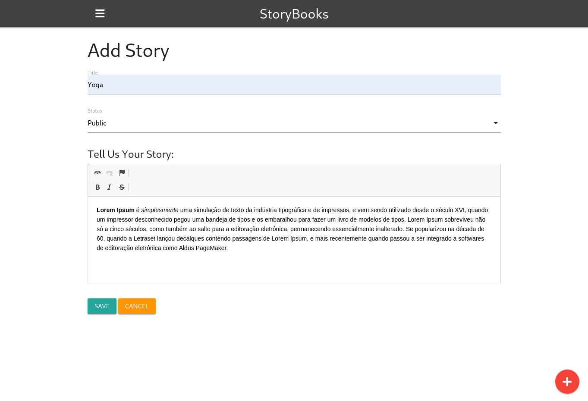

<h1 align="center">StoryBooks</h1>

<p align="center">	
   <a href="https://www.linkedin.com/in/rafael-goulartb/">
      
   </a>
  <a href="https://github.com/RafaelGoulartB/devops-crash-course#readme">
    
  </a>
  <a href="https://github.com/RafaelGoulartB/devops-crash-course/graphs/commit-activity">
    
  </a>
  <a href="https://github.com/RafaelGoulartB/devops-crash-course/blob/master/LICENSE">
    
  </a>
  
  
  
</p>

> Create public and private stories from your life

<div align="center">
  <sub>The Blog project. Built with ❤︎ by
    <a href="https://github.com/RafaelGoulartB">Rafael Goulart</a> and
    <a href="https://github.com/RafaelGoulartB/devops-crash-course/graphs/contributors">
      contributors
    </a>
  </sub>
</div>

---

This app uses Node.js/Express/MongoDB with Google OAuth for authentication

It uses Docker + docker-compose for local execution, Terraform to provision cloud resources, and Github actions for CI/CD.

For full tutorial, see the video I created for the [Traversy Media YouTube channel](https://www.youtube.com/c/TraversyMedia/videos).

<br />
<div align="center">
  
  
</div>

---

# :pushpin: Table of Contents

* [Website](#eyes-website)
* [Technologies](#computer-technologies)
* [Features](#rocket-features)
* [How to run](#construction_worker-how-to-run)
* [Found a bug? Missing a specific feature?](#bug-issues)
* [Contributing](#tada-contributing)
* [License](#closed_book-license)


# :eyes: Website
👉 https://storybooks.devopsdirective.com

# :computer: Technologies
This project was made using the follow technologies:

* [Docker](https://www.docker.com/)     
* [Terraform](https://www.terraform.io/)      
* [Github Actions](https://github.com/features/actions)    
* [MongoDB](https://www.mongodb.com/)     
* [Express](http://expressjs.com/)     

# :rocket: Features

- Create Story
- Dockerized Aplication

# :construction_worker: How to run
Add your **MongoDB URI** and **Google OAuth** credentials to the `config.env` file.    

*MongoDB URI*: `mongodb://mongo:27017/storybooks`

Then run:
```
make run-local
```

This will use docker-compose to build the application into a docker image and then run it alongside a Mongo DB container.

Open [http://localhost:3000](http://localhost:3000) with your browser to see the result.
<br>

## Github Action

`.github/workflows/build-push-deploy.yaml` contains a workflow which deploys to a staging environment on pushes to the `main` branch and to a production environment on pushes of tags of the form `v#.#.#`.


# :bug: Issues

Feel free to **file a new issue** with a respective title and description on the the [DevOps Crash Course](https://github.com/RafaelGoulartB/devops-crash-course/issues) repository. If you already found a solution to your problem, **i would love to review your pull request**!

---

[⬆ Back to Top](#pushpin-table-of-contents)

# :tada: Contributing
First of all, thank you for being interested in helping out, your time is always appreciated in every way. :100:

Here's some tips:

* Check the [issues page](https://github.com/RafaelGoulartB/devops-crash-course/issues) for already opened issues (or maybe even closed ones) that might already address your question/bug/feature request.
* Feature requests are welcomed! Provide some details on why it would be helpful for you and others, explain how you're using bull-board and if possible even some screenshots if you are willing to mock something!

Check out the [contributing](./CONTRIBUTING.md) page to see the best places to file issues, start discussions and begin contributing.

# :closed_book: License

Released in 2020.
This project is under the [MIT license](./LICENSE).

Made with love by [RafaelGoulartB](https://github.com/RafaelGoulartB) 🚀
